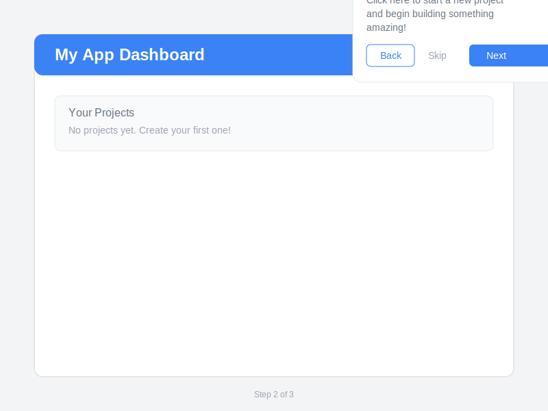
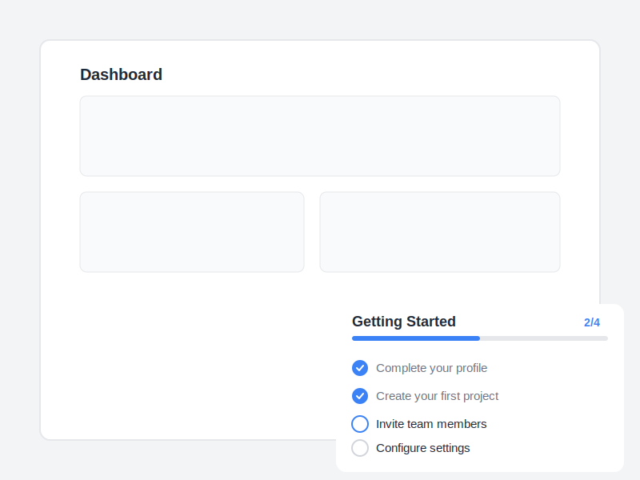

# 🚀 Onboard Flow Engine

A powerful, beautiful user onboarding library for React with product tours, tooltips, checklists, and advanced analytics.

## 📸 Screenshots

### Tooltip with Spotlight


### Interactive Checklist


## ✨ Features

- 🎯 **Multiple Step Types**: Tooltips, modals, spotlights, and checklists
- 🌓 **Dark Mode Support**: Auto, light, or dark themes with system preference detection
- 📊 **Progress Tracking**: Automatic progress persistence with localStorage
- 🧪 **A/B Testing**: Built-in variant testing for flow optimization
- 📈 **Analytics**: Track completion rates, user behavior, and flow performance
- 🎨 **Beautiful UI**: Smooth animations and customizable themes
- 🔧 **Flexible API**: Easy to integrate and customize
- 💾 **Auto-save**: Progress automatically saved and restored
- 🎭 **Spotlight Mode**: Highlight elements with animated overlays
- ✖️ **Dismissible Overlays**: Configurable click-outside-to-dismiss behavior
- ⌨️ **Keyboard Support**: Full keyboard navigation and accessibility

## 📦 Installation

```bash
npm install onboard-flow-engine
```

## 🚀 Quick Start

```tsx
import { OnboardingProvider, flowEngine, useOnboarding } from 'onboard-flow-engine';

// 1. Register your flow
flowEngine.registerFlow({
  id: 'welcome-tour',
  name: 'Welcome Tour',
  steps: [
    {
      id: 'step-1',
      type: 'modal',
      title: 'Welcome! 👋',
      content: 'Let us show you around',
      skippable: true,
    },
    {
      id: 'step-2',
      type: 'tooltip',
      title: 'Create New Project',
      content: 'Click here to start a new project',
      target: '#create-button',
      position: 'bottom',
    },
  ],
  theme: {
    primaryColor: '#3b82f6',
    borderRadius: '12px',
    mode: 'auto', // 'light', 'dark', or 'auto'
  },
  dismissOnOverlayClick: true, // Allow users to dismiss by clicking outside
});

// 2. Wrap your app
function App() {
  return (
    <OnboardingProvider>
      <YourApp />
    </OnboardingProvider>
  );
}

// 3. Start the flow
function YourComponent() {
  const { startFlow } = useOnboarding();
  
  useEffect(() => {
    startFlow('welcome-tour');
  }, []);
  
  return <div>Your content</div>;
}
```

## 📚 Advanced Usage

### Checklist Component

```tsx
import { Checklist } from 'onboard-flow-engine';

<Checklist
  title="Getting Started"
  items={[
    { id: '1', title: 'Create your first project', completed: false },
    { id: '2', title: 'Invite team members', completed: false },
    { id: '3', title: 'Configure settings', completed: false },
  ]}
  onItemComplete={(itemId) => console.log('Completed:', itemId)}
  theme={{ primaryColor: '#10b981' }}
/>
```

### A/B Testing

```tsx
import { useABTest } from 'onboard-flow-engine';

function MyComponent() {
  const { variant, results, winningVariant } = useABTest('welcome-tour');
  
  // Start flow with variant
  startFlow('welcome-tour', variant);
  
  // Check results
  console.log('Variant A completions:', results.A);
  console.log('Variant B completions:', results.B);
  console.log('Winner:', winningVariant);
}
```

### Analytics

```tsx
import { flowEngine } from 'onboard-flow-engine';

// Get completion rate
const rate = flowEngine.getCompletionRate('welcome-tour');
console.log(`${rate}% completion rate`);

// Get all analytics events
const events = flowEngine.getAnalytics('welcome-tour');
console.log('Events:', events);
```

### Dark Mode Support

```tsx
// Auto mode - follows system preference
theme: { mode: 'auto' }

// Always dark
theme: { mode: 'dark' }

// Always light
theme: { mode: 'light' }
```

### Dismissible Overlays

Control whether users can dismiss tours by clicking outside:

```tsx
flowEngine.registerFlow({
  id: 'my-tour',
  dismissOnOverlayClick: true, // Users can click outside to dismiss
  steps: [...],
});
```

When enabled:
- Clicking the overlay dismisses the tour
- Close buttons (×) appear on tooltips and modals
- The tour is marked as "skipped" in analytics

### Custom Themes

```tsx
const customTheme = {
  primaryColor: '#8b5cf6',
  backgroundColor: '#ffffff',
  textColor: '#1f2937',
  borderRadius: '16px',
  fontFamily: 'Inter, sans-serif',
  overlayColor: 'rgba(0, 0, 0, 0.8)',
  spotlightPadding: 12,
  mode: 'auto', // Follows system preference
};

flowEngine.registerFlow({
  id: 'custom-tour',
  name: 'Custom Tour',
  steps: [...],
  theme: customTheme,
});
```

### Step Types

#### Tooltip
```tsx
{
  id: 'tooltip-step',
  type: 'tooltip',
  title: 'Feature Name',
  content: 'Description of the feature',
  target: '#element-selector',
  position: 'bottom', // 'top' | 'bottom' | 'left' | 'right'
  skippable: true,
}
```

#### Modal
```tsx
{
  id: 'modal-step',
  type: 'modal',
  title: 'Welcome!',
  content: 'Get started with our platform',
  dismissible: true,
}
```

#### Spotlight
```tsx
{
  id: 'spotlight-step',
  type: 'spotlight',
  title: 'Important Feature',
  content: 'This is a key feature',
  target: '#important-element',
}
```

### Lifecycle Hooks

```tsx
{
  id: 'step-with-hooks',
  type: 'tooltip',
  title: 'Step Title',
  content: 'Step content',
  onEnter: () => console.log('Step entered'),
  onExit: () => console.log('Step exited'),
  condition: () => userIsLoggedIn(), // Only show if condition is true
}
```

### Flow Callbacks

```tsx
flowEngine.registerFlow({
  id: 'my-flow',
  name: 'My Flow',
  steps: [...],
  onComplete: () => {
    console.log('Flow completed!');
    // Track completion, show celebration, etc.
  },
  onSkip: () => {
    console.log('Flow skipped');
    // Track skip event
  },
});
```

## 🎨 Customization

All components support full theme customization:

- `primaryColor`: Main accent color
- `backgroundColor`: Background color for tooltips/modals
- `textColor`: Text color
- `borderRadius`: Border radius for all elements
- `fontFamily`: Custom font family
- `overlayColor`: Spotlight overlay color
- `spotlightPadding`: Padding around highlighted elements

## 📊 Analytics Events

The engine tracks these events automatically:
- `start`: Flow started
- `complete`: Step/flow completed
- `skip`: Flow skipped
- `next`: Next step
- `prev`: Previous step
- `dismiss`: Modal dismissed

## 🔧 API Reference

### flowEngine

- `registerFlow(config: FlowConfig)`: Register a new flow
- `getFlow(flowId: string)`: Get flow configuration
- `getProgress(flowId: string)`: Get flow progress
- `getCompletionRate(flowId: string)`: Get completion percentage
- `getABTestResults(flowId: string)`: Get A/B test results
- `getAnalytics(flowId?: string)`: Get analytics events
- `resetProgress(flowId: string)`: Reset flow progress

### useOnboarding Hook

- `startFlow(flowId: string, variant?: 'A' | 'B')`: Start a flow
- `currentFlow`: Current active flow instance
- `progress`: Current flow progress

### useFlow Hook

- `progress`: Flow progress data
- `completionRate`: Completion rate percentage
- `analytics`: Analytics events for the flow

### useABTest Hook

- `variant`: Current variant ('A' or 'B')
- `results`: Completion counts for each variant
- `winningVariant`: Variant with more completions

## 📄 License

MIT © [codecrypt112](https://github.com/codecrypt112)

## 🔗 Links

- [GitHub Repository](https://github.com/codecrypt112/Onboard-Flow-Engine)
- [Documentation](./docs/README.md)
- [Report Issues](https://github.com/codecrypt112/Onboard-Flow-Engine/issues)

## 🤝 Contributing

Contributions welcome! Please open an issue or PR on [GitHub](https://github.com/codecrypt112/Onboard-Flow-Engine).

## 👤 Author

**codecrypt112**
- GitHub: [@codecrypt112](https://github.com/codecrypt112)
